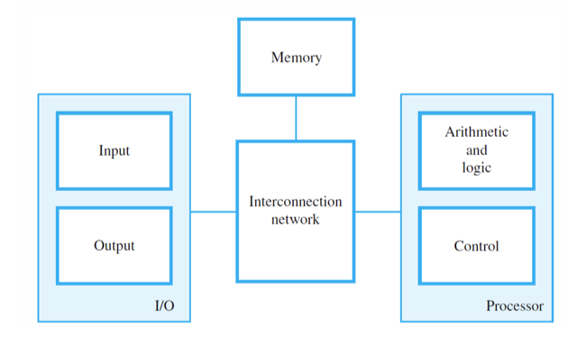
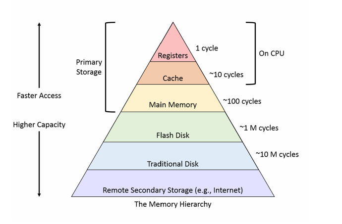
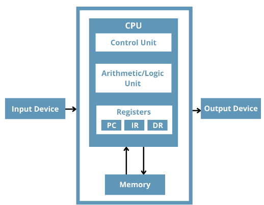
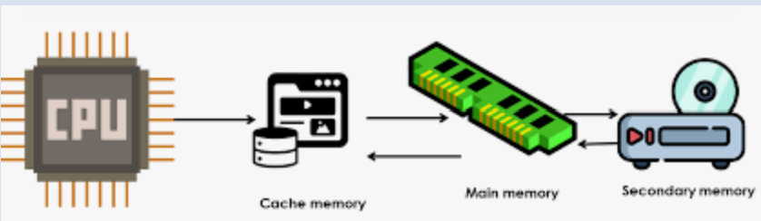
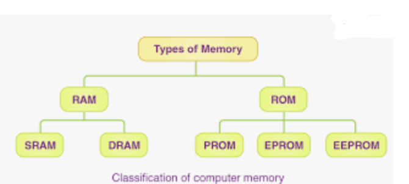

# MEMORY HIERARCHY

## MEMORY UNIT

Memory unit is one of the functional units in a computer. In computing, it refers to a component of a computer system that stores data for later retrieval.

This can include:

- Random Access Memory (RAM) for temporary storage while the computer is running.
- Various forms of persistent storage like:
  - Hard drives
  - Solid State Drives (SSD)
  - Flash mem 
  
  A memory unit, in the context of computing, refers to a component or system that stores digital data temporarily or permanently for processing, retrieval, and storage purposes. Memory units come in various forms and serve different functions within a computer system. Here's a brief overview:

- **Primary Memory (Main Memory):** Primary memory, also known as main memory or RAM (Random Access Memory), is a volatile form of memory that stores data and instructions that the CPU (Central Processing Unit) needs to access quickly during program execution. It is used to hold currently executing programs, data being actively processed, and frequently accessed instructions. Primary memory is fast but loses its contents when power is turned off.
  
- **Secondary Memory (Secondary Storage):** Secondary memory, also known as secondary storage, is non-volatile memory used for long-term storage of data and programs. Unlike primary memory, secondary memory retains data even when power is turned off. Examples include hard disk drives (HDDs), solid-state drives (SSDs), optical discs (CDs, DVDs, Blu-ray), magnetic tapes, and cloud storage. Secondary memory provides larger storage capacity but is slower to access compared to primary memory.
  
- **Cache Memory:** Cache memory is a small, high-speed memory unit located between the CPU and main memory. It stores frequently accessed data and instructions to speed up processing by reducing the time needed to fetch data from main memory. Cache memory operates on the principle of locality, exploiting the tendency of programs to access the same memory locations repeatedly.
  
- **Registers:** Registers are the smallest and fastest form of memory located within the CPU. They hold data, instructions, and memory addresses used by the CPU during program execution. Registers have the fastest access time but limited capacity, typically holding only a few bytes of data at a time.
  
- **Virtual Memory:** Virtual memory is a memory management technique that extends the apparent size of the available primary memory by temporarily transferring data between main memory and secondary storage. It allows programs to use more memory than physically available by swapping data between RAM and disk storage as needed.
  
Overall, memory units play a crucial role in computer systems by providing storage solutions for data and instructions, facilitating efficient processing, and enabling seamless execution of programs. Each type of memory unit serves a specific purpose in managing data within a computer system.

These are used for long-term storage of data even when the computer is turned off.
# MEMORY HIERARCHY

The arrangement of various memory types in a computer system according to their size, speed, and proximity to the central processing unit is known as memory hierarchy. By allowing for greater store capacity for information that is not frequently accessed, this hierarchy is intended to maximize overall system efficiency by facilitating quick access to commonly utilized data and instructions.

The notion of memory hierarchy acknowledges that not every piece of information and instruction within a computer program is accessed as frequently or urgently as others. Computer systems are able to efficiently balance speed, cost, and capacity for a variety of computational tasks by utilizing a hierarchical memory arrangement.

To put it another way, memory hierarchy can be compared to a pyramid, with RAM and secondary storage devices like hard drives at the base and CPU registers and cache memory, which are the smallest and quickest memory units, at the top. By doing this, the computer may retrieve data from slower storage devices more rapidly and spend less time waiting for information that it needs.

A concept in computer architecture known as memory hierarchy arranges various forms of computer memory into a hierarchy according to factors including  size,cost and speed.Memory hierarchy serves the primary function of bridging the gap between the slower but larger and less expensive memory (like RAM and disk storage) and the faster but more expensive and limited memory immediately accessible by the CPU (like registers and cache). 

The levels of memory hierarchy in a typical computer system, ordered from fastest and smallest to slowest and largest, are as follows:

1. Registers

2. Cache

3. Main Memory

4. Flash Disk

5. Traditional Disk

6. Remote Secondary Storage

Memory hierarchy serves the primary function of bridging the gap between the slower but larger and less expensive memory (like RAM and disk storage) and the faster but more expensive and limited memory immediately accessible by the CPU (like registers and cache). It arranges various memory types in a computer system according to factors including size, cost, and speed.

The levels of memory hierarchy in a typical computer system, ordered from fastest and smallest to slowest and largest, are as follows:

# Registers

Registers are the smallest and fastest storage units in a computer system when it comes to memory hierarchy. Registers are integral to the operation of the CPU and are therefore usually not explicitly included in the memory hierarchy, but they are essential to system performance. Registers are places where data and instructions that the CPU is currently processing are temporarily stored. They include data that is required to carry out instructions, such as memory addresses for data access, operands for arithmetic and logical operations, and intermediate outcomes of calculations. Registers are essential for effective instruction execution and data manipulation during program execution. Registers are sometimes regarded as the first level of memory in terms of access speed, even though they are not directly included in the memory hierarchy. With access times measured in nanoseconds, registers have the fastest access times of any memory component. Registers are used to store important information and instructions that the CPU needs to access right away while executing a program because of their close proximity to the CPU and fast processing speed. Registers have numerous real-time applications across various computing systems, including processor operations, system control, function calls and subroutines, data movement, interrupt handling, and embedded systems.

# Cache Memory

 In a computer system, cache memory is a kind of high-speed volatile memory that sits between the CPU (central processing unit) and RAM (main memory). It reduces the average time taken to access memory by acting as a buffer to speed up data access by storing frequently used commands and data. The basic goal of cache memory is to close the speed difference between the slower but more capacious main memory (RAM) and the faster but smaller CPU.

Cache memory minimizes the need to access slower main memory by keeping frequently accessed information and instructions closer to the CPU, therefore enhancing system speed.

## Establishment

There are different layers of cache memory, called L1, L2, and occasionally L3 cache. L2 cache is larger and located farther away from the CPU than L1 cache, which is the smallest. An extra L3 cache, which is larger still and frequently shared by several CPU cores, may be present in some systems.

## Data Management

Cache memory employs caching algorithms to determine which data and instructions to store in the cache and how to manage the cache's contents efficiently. Common caching algorithms include least recently used (LRU), least frequently used (LFU), and random replacement.

## Cache Coherency

In multi-core systems where multiple CPU cores share access to the same cache memory, cache coherency protocols ensure that all cores have a consistent view of memory. These protocols manage data synchronization and maintain data integrity across multiple caches.
## Cache Memory

Cache memory plays a crucial role in modern computer systems, helping to optimize the use of available resources and improve overall system responsiveness and efficiency.

## Cache Hit and Cache Miss

The cache determines if the desired data or instructions are already in the cache when the CPU makes a request for them from memory. If so, it is referred to as a cache hit and allows for speedy data retrieval. It is referred to as a cache miss when the requested data cannot be found in the cache; this requires more time to fetch the data from main memory.

## Cache Size and Performance

System performance is greatly impacted by the amount and configuration of cache memory. Performance can be enhanced by larger caches since they can store more data and cause fewer cache misses. Larger caches, however, also usually cost more and use more electricity.

## Consistent View of Memory and Cache Coherency

In multi-core systems where multiple CPU cores share access to the same cache memory, cache coherency protocols ensure that all cores have a consistent view of memory. These protocols manage data synchronization and maintain data integrity across multiple caches.

Cache memory finds real-world applications in various computing systems to enhance...

Cache memory plays a crucial role in modern computer systems, helping to optimize the use of available resources and improve overall system responsiveness and efficiency. Here are some examples of its real-world applications:

1. Web Servers and Content Delivery Networks (CDNs)
2. Database Systems
3. Operating Systems
4. Graphics Processing Units (GPUs)
5. Artificial Intelligence and Machine Learning
6. Embedded Systems
7. Networking Equipment

# Main Memory

Main memory is a form of volatile computer memory that is sometimes called "primary memory" or random-access memory (RAM). It is used to store data and instructions that are actively being used by the CPU (central processing unit) during program execution. It acts as a computer system's main working memory, enabling quick access to the information and commands needed to complete tasks.

## Important Details

- Main memory is volatile, which means that it needs constant power to hold onto the data it has stored. The information kept in main memory is lost when the power is switched off or the machine is restarted.
## Non-Volatile Storage Technologies

Non-volatile storage technologies, such as solid-state drives (SSDs) and hard disk drives (HDDs), maintain data even in the event of a power outage.

## Speed

When it comes to access times, main memory is quicker than secondary storage like HDDs and SSDs. Compared to secondary storage, which frequently has access times measured in milliseconds, main memory typically has access times measured in nanoseconds, making it substantially faster.

## Capacity

The capacity of main memory determines how much information and instructions may be stored at once. In current computing systems, main memory capacities can vary greatly, from a few gigabytes to several terabytes. However, because of financial constraints and physical limitations, main memory capacities are typically lower than those of secondary storage devices.

# Flash Disk

A flash disk, also known as a USB flash drive or thumb drive, is a portable storage device that uses flash memory to store data. It's small, lightweight, and often shaped like a small rectangle or stick. Flash disks connect to computers and other devices via a USB port, making them easy to use for transferring files between different devices.

Flash disks have several advantages:

- **Portability:** They are small enough to fit in your pocket or on a keychain, making them highly portable.
- **Durability:** Unlike traditional hard disk drives, flash disks have no moving parts, so they are less prone to damage from drops or shocks.
- **Speed:** Flash disks offer fast read and write speeds, allowing for quick data transfer.
- **Reusability:** Files can be added, deleted, or modified on a flash disk repeatedly.
- **Compatibility:** They work with most computers and devices that have a USB port.

Flash disks come in various storage capacities, ranging from a few gigabytes to several terabytes, and are widely used for storing and transporting files such as documents, photos, videos, and software applications.

## Real time application
Flash disks, also known as USB flash drives or thumb drives, have numerous real-time applications across various industries and everyday scenarios due to their portability, convenience, and versatility. Here are some examples:

- **Data Transfer and Backup:** Flash disks are commonly used for transferring files between computers, especially when internet access is limited or when transferring sensitive data securely. They are also used for creating backups of important files, providing a portable and reliable storage solution.

- **Portable Operating Systems:** Flash disks can be used to carry portable operating systems like Linux distributions, allowing users to boot into a familiar environment on any computer without affecting the host system. This is particularly useful for troubleshooting, system recovery, or maintaining privacy when using public computers.

- **Software Distribution and Installation:** Flash disks are often used by software developers and IT professionals to distribute software updates, patches, and installations. They provide a convenient way to deploy software across multiple devices without the need for physical media or internet downloads.

- **Digital Forensics:** In the field of digital forensics, flash disks are used to collect, store, and analyze digital evidence from computers and other electronic devices. They help forensic investigators gather data without altering the original source and provide a portable storage solution for transporting evidence to a lab for analysis.

- **Presentation and Media Playback:** Flash disks are used to store presentations, documents, videos, and other multimedia content for business meetings, conferences, and educational purposes. They offer a convenient way to carry and deliver content without relying on an internet connection or external hardware.

- **Embedded Systems and IoT Devices:** Flash disks are used in embedded systems and Internet of Things (IoT) devices to store firmware, configuration files, and other essential data. They provide non-volatile storage in compact form factors, enabling efficient data storage and retrieval in resource-constrained environments.

- **Digital Signage and Advertising:** Flash disks are used to store and playback digital signage content in retail stores, restaurants, airports, and other public spaces. They allow businesses to create dynamic advertising displays with high-resolution images, videos, and interactive content.

- **Portable Applications and Utilities:** Many software applications and utilities are available in portable versions that can be run directly from a flash disk without installation. These portable apps include productivity tools, antivirus scanners, encryption software, and system maintenance utilities, providing users with on-the-go access to essential tools.

Overall, flash disks play a crucial role in various real-time applications, offering a portable, reliable, and efficient storage solution for individuals, businesses, and organizations across different sectors.

---

# Traditional Disks (HDDs)

Traditional disks, often referred to as hard disk drives (HDDs), are storage devices that use magnetic storage to store and retrieve digital information. They consist of one or more spinning disks coated with a magnetic material and read/write heads that move across the disk's surface to access and modify data.

Here are some key points about traditional disks:

- **Storage Technology:** Traditional disks store data magnetically on spinning platters. Data is written and read using magnetic heads that move rapidly across the disk's surface.
- **Capacity:** HDDs come in various storage capacities, typically ranging from a few hundred gigabytes to multiple terabytes. Larger capacity HDDs are commonly used in servers and desktop computers for storing large amounts of data.
- **Performance:** While traditional disks are generally slower than solid-state drives (SSDs) in terms of data access speed, they are still widely used in scenarios where cost-effectiveness and high capacity are prioritized over speed.
- **Durability:** HDDs contain moving parts, such as spinning disks and read/write heads, which make them more susceptible to mechanical failures, such as head crashes or motor failures, especially in environments with frequent movement or shocks.
- **Usage:** Traditional disks have been the primary storage technology in computers for several decades. They are commonly used in desktop computers, laptops, servers, and enterprise storage systems.
- **Applications:** HDDs are suitable for a wide range of applications, including storing operating systems, software applications, documents, multimedia files, and databases.
- **Cost:** Compared to solid-state drives, traditional disks generally offer higher storage capacities at a lower cost per gigabyte, making them a cost-effective solution for storing large volumes of data.

While solid-state drives (SSDs) have become increasingly popular due to their faster performance and greater durability, traditional disks remain relevant for their cost-effectiveness and high capacity storage capabilities, particularly in scenarios where performance requirements are not the primary concern.

## Real time application
Traditional disks, also known as hard disk drives (HDDs), have been a fundamental component of computing systems for decades, offering reliable storage solutions for various real-time applications across different industries. Here are some examples:

- **Enterprise Data Storage:** Traditional disks are extensively used in data centers and enterprise environments for storing vast amounts of data, including databases, application files, user data, and system backups. They provide high-capacity storage at a relatively low cost per gigabyte, making them suitable for archival and long-term data retention.

- **Server Hosting:** In server hosting environments, traditional disks are used to store operating system files, application data, website content, and user databases. They offer reliable storage solutions for hosting websites, web applications, email servers, and file sharing services.

- **Desktop and Laptop Computers:** Traditional disks are commonly found in desktop computers and laptops, where they serve as the primary storage medium for the operating system, software applications, personal files, and multimedia content. They provide ample storage space for storing documents, photos, videos, music, and other digital assets.

- **Workstation Applications:** In graphic design, video editing, engineering, and other workstation applications, traditional disks are used to store large files and project data. They provide the capacity and performance required for handling complex projects and high-resolution media files.

- **Network-Attached Storage (NAS):** Traditional disks are used in NAS devices to create centralized storage systems for homes, small businesses, and enterprise environments. NAS systems provide file sharing, data backup, and media streaming capabilities across local networks, leveraging traditional disks for reliable data storage.

- **Video Surveillance Systems:** Traditional disks are used in video surveillance systems to store recorded footage from security cameras. They offer high-capacity storage solutions for storing surveillance footage, allowing organizations to maintain video archives for security and compliance purposes.

- **Medical Imaging and Healthcare:** In medical imaging applications, such as MRI, CT scans, and ultrasound, traditional disks are used to store and retrieve large medical image files. They provide reliable storage solutions for healthcare providers, enabling efficient access to patient data and medical records.

- **Industrial Control Systems:** Traditional disks are used in industrial control systems (ICS) and supervisory control and data acquisition (SCADA) systems for storing historical data, event logs, and configuration files. They provide robust storage solutions for critical infrastructure and manufacturing operations.

- **Financial Services and Banking:** In the financial services sector, traditional disks are used for storing transaction records, customer data, and regulatory compliance documents. They provide secure and reliable storage solutions for banking systems, trading platforms, and financial analytics applications.

- **Education and Research:** Traditional disks are used in educational institutions and research organizations for storing academic resources, research data, and digital libraries. They provide cost-effective storage solutions for educational materials, scientific datasets, and scholarly publications.

Overall, traditional disks continue to play a crucial role in various real-time applications, offering reliable storage solutions for businesses, organizations, and individuals across different sectors.

---

# Secondary Storage

A memory unit, in the context of computing, refers to a component or system that stores digital data temporarily or permanently for processing, retrieval, and storage purposes. Memory units come in various forms and serve different functions within a computer system. Here's a brief overview:

- **Primary Memory (Main Memory):** Primary memory, also known as main memory or RAM (Random Access Memory), is a volatile form of memory that stores data and instructions that the CPU (Central Processing Unit) needs to access quickly during program execution. It is used to hold currently executing programs, data being actively processed, and frequently accessed instructions. Primary memory is fast but loses its contents when power is turned off.
  
- **Secondary Memory (Secondary Storage):** Secondary memory, also known as secondary storage, is non-volatile memory used for long-term storage of data and programs. Unlike primary memory, secondary memory retains data even when power is turned off. Examples include hard disk drives (HDDs), solid-state drives (SSDs), optical discs (CDs, DVDs, Blu-ray), magnetic tapes, and cloud storage. Secondary memory provides larger storage capacity but is slower to access compared to primary memory.
  
- **Cache Memory:** Cache memory is a small, high-speed memory unit located between the CPU and main memory. It stores frequently accessed data and instructions to speed up processing by reducing the time needed to fetch data from main memory. Cache memory operates on the principle of locality, exploiting the tendency of programs to access the same memory locations repeatedly.
  
- **Registers:** Registers are the smallest and fastest form of memory located within the CPU. They hold data, instructions, and memory addresses used by the CPU during program execution. Registers have the fastest access time but limited capacity, typically holding only a few bytes of data at a time.
  
- **Virtual Memory:** Virtual memory is a memory management technique that extends the apparent size of the available primary memory by temporarily transferring data between main memory and secondary storage. It allows programs to use more memory than physically available by swapping data between RAM and disk storage as needed.
  
Overall, memory units play a crucial role in computer systems by providing storage solutions for data and instructions, facilitating efficient processing, and enabling seamless execution of programs. Each type of memory unit serves a specific purpose in managing data within a computer system.
## Real time application
Real-time applications of secondary memory, also known as secondary storage, involve utilizing persistent storage solutions to meet immediate data access and storage needs across various industries. Here are some real-time applications:

- **Data Backup and Recovery:** Secondary memory is crucial for real-time data backup and recovery solutions. Systems continuously back up critical data to secondary storage devices such as external hard drives, network-attached storage (NAS), or cloud storage services. In case of data loss or system failure, real-time recovery mechanisms retrieve the latest backup to minimize downtime.

- **Content Streaming Services:** Secondary memory is essential for storing vast libraries of multimedia content in real-time streaming services such as video-on-demand platforms and music streaming services. Content is stored on secondary storage servers and accessed by users in real-time over the internet, ensuring seamless playback without delays.

- **Financial Trading Systems:** In financial trading systems, secondary memory is used to store historical market data, transaction records, and trade executions in real-time. Traders rely on secondary storage solutions to access large volumes of data instantly for analysis, decision-making, and compliance purposes.

- **Healthcare Records Management:** Secondary memory plays a vital role in managing electronic health records (EHRs) and medical imaging data in real-time healthcare systems. Patient data, including medical histories, diagnostic images, and treatment records, are securely stored on secondary storage devices for immediate access by healthcare providers during patient consultations and emergencies.

- **Online Retail and E-commerce:** Secondary memory is utilized in real-time inventory management systems for online retail and e-commerce platforms. Product catalogs, inventory levels, customer orders, and transaction records are stored in secondary storage systems, enabling real-time updates and seamless order processing to meet customer demands.

- **Supply Chain Management:** Secondary memory is employed in real-time supply chain management systems to store shipment data, inventory tracking information, and logistics records. Data stored in secondary storage devices facilitates real-time monitoring of goods, optimization of transportation routes, and timely delivery of products to customers.

- **Telecommunications Networks:** Secondary memory is used in real-time telecommunications networks for storing call records, network traffic data, and subscriber information. Secondary storage solutions enable telecommunications providers to manage and analyze large volumes of data in real-time to optimize network performance and ensure quality of service.

- **Digital Surveillance and Security:** Secondary memory is essential for real-time digital surveillance and security systems, storing video footage, access logs, and security events. Surveillance cameras continuously record footage to secondary storage devices, allowing real-time monitoring, event detection, and forensic analysis for security purposes.

Overall, real-time applications of secondary memory are integral to modern systems, enabling instant access to vast amounts of data for critical operations, decision-making, and service delivery across diverse industries.
